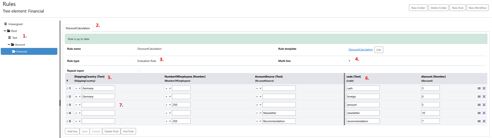
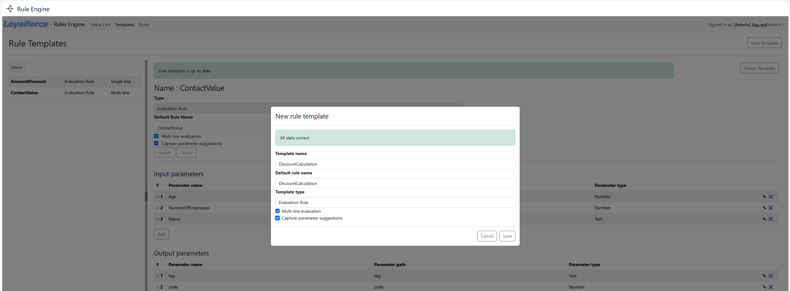
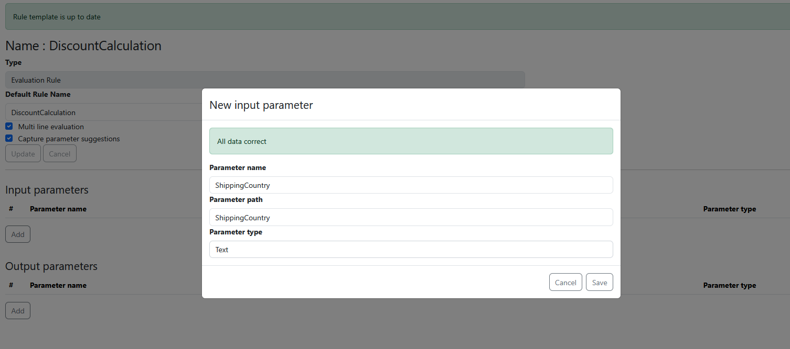
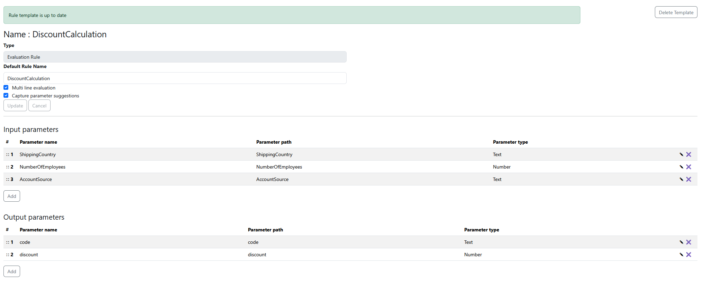
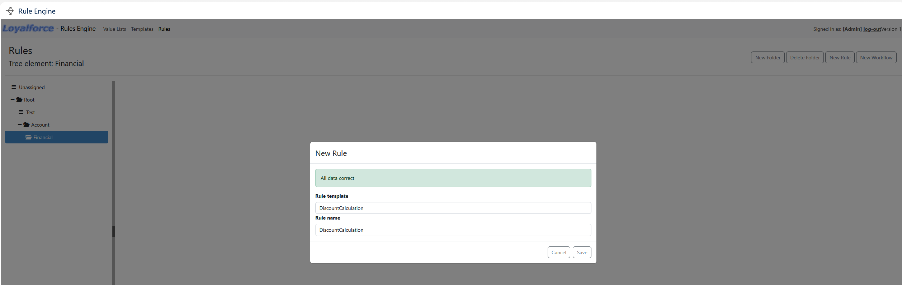

# The PAW Rule Engine

A **Business Rules Management System (BRMS)**, or **Rule Engine**, is a software solution used to define, deploy, execute, and monitor business logic independently from an application's core code.

Essentially, it allows organizations to separate "the rules of the business" from "the plumbing of the software."

---

**Why Use a Rule Engine?**

In traditional development, business logic is often hard-coded into the application. If a policy changes (e.g., a new discount or a regulatory update), developers must rewrite, test, and redeploy the code. 

With a BRMS, **Business Analysts** can often update logic through a UI without involving the engineering team for every minor change.

| Feature | Hard-Coded Logic | BRMS / Rule Engine |
| :--- | :--- | :--- |
| **Agility** | Slow (requires full CI/CD cycle) | Fast (instant or near-instant updates) |
| **Visibility** | Low (buried in source code) | High (readable via tables or flowcharts) |
| **Ownership** | Developers only | Business Analysts & Product Owners |
| **Accuracy** | Prone to "code rot" | Centralized "Source of Truth" |

---

**How It Works**

The PAW Rule Engine uses a **declarative** approach. Instead of writing a procedure, you define conditions and results.

> **Example Rule:**
> **IF** `customer_tier` IS "Platinum"  
> **AND** `order_value` > 500  
> **THEN** `apply_discount` = 20%  
> **AND** `shipping_method` = "Overnight"


## Rules Explained

A rule has the following features:
- One or more inputs
- One or more outputs
- One or more evaluation lines
- Operators and comparative values in the evaluation lines
- Evaluates from the top line to the bottom line
- Single Line rules return the output of the first line to match
- Multi Line rules return the output for each match

An example rule in the PAW Rule Engine:



1. The Folder where your rule is placed. In case a Rule is not placed inside a folder, it will be created in the default `unassigned` folder.
2. The Tabs represent the rules inside the folder.
3. The Type of the rule. Aside from Evaluation Rules, there are also Lookup Tables available. For more info, please refer to the complete Rule Engine documentation.
4. Checkbox if the Rule is a Single Line or Multi Line evaluation rule.
5. Each column represents an input value. They can be defined inside the Rule Template.
6. Each column represents an output value. They can be defined inside the Rule Template.
7. An Evaluation Line where you can define critera if the line matches or not.

## API Calls

The Evaluation API of the rule engine can process Single and Bulk evaluation requests.

Single Request Endpoint:  
`/loyalforce_rules/api/evaluate`

Bulk Request Endpoint:  
`/loyalforce_rules/api/v1/rules/evaluate_batch`

Both endpoints execute the same logic, but the Bulk Request Endpoint only accepts an array of single requests and returns an array with the single request results.

The API Output of the example Rule looks as following (Bulk Request):

**Example Input:**
```json
[
    {
        "name": "DiscountCalculation",
        "path": "Root/Account/Financial",
        "input": {
            "ShippingCountry": "France",
            "NumberOfEmployees": 350,
            "AccountSource": "Newsletter"
        }
    }
]
```

**Example Output:**
```json
[
    {
        "executed": {
            "path": "Root/Account/Financial",
            "rules": [
                "DiscountCalculation"
            ]
        },
        "output": [
            {
                "code": "foreign",
                "discount": 0.0,
                "row_number": 2
            },
            {
                "code": "amount",
                "discount": 5.0,
                "row_number": 3
            },
            {
                "code": "newsletter",
                "discount": 10.0,
                "row_number": 4
            }
        ],
        "success": true
    }
]
```

Each matched line is represented by a JSON object inside the `output` array.

## Tutorial: Create a new Rule (Template)

1. Create a Rule Template



2. Define input and output parameters



3. Finish the template



4. Create a new Rule



5. Setup the rule


## Integrations

### Salesforce

[Salesforce Connector Documentation](salesforce/INTRO.md)

### Custom Integration

tbd