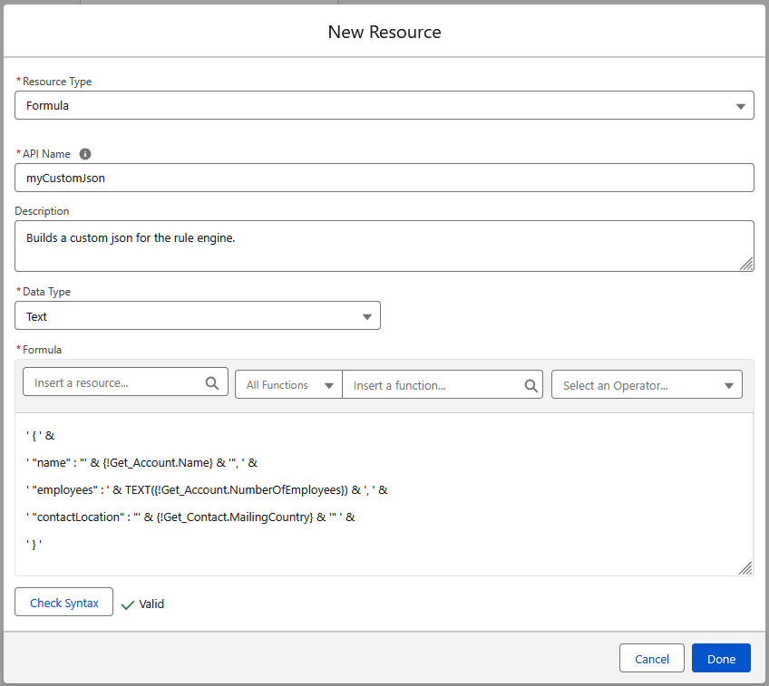

# Rule Engine Flow API

The Flow API offers several Apex Actions to execute Rules and parse the results. All Actions can be found in Flow Builder under `Apex Action > Rule Engine`.

## Tutorial

A Tutorial on how to use the Flow API can be accessed here:

[Flow API Tutorial](FlowTutorial.md)

## Apex Defined Data Types

### Evaluation Input

Some Apex Actions are using the `Evaluation Input` as input:

[Evaluation Input Class](EvaluationInput.md)

### Evaluation Output

Some Apex Actions are using the `Evaluation Output` as output:

[Evaluation Output Class](EvaluationOutput.md)

## Actions

- [Execute Rule (Single SObject)](#execute-rule-single-sobject)  
Evaluates a specific Rule for a given SObject.

- [Execute Rule (SObject Collection)](#execute-rule-sobject-collection)  
Evaluates a specific Rule for a given List of SObjects

- [Execute Rule (Single JSON)](#execute-rule-single-json)  
Evaluates a rule for a single JSON

- [Execute Rule (JSON Collection)](#execute-rule-json-collection)  
Evaluates different rules for different JSONs

- [Extract Boolean](#extract-boolean)  
Extracts a Boolean value from a given JSON string using a specific path. This utility is part of the Rule Engine and uses an untyped parser to navigate the JSON structure.

- [Extract Datetime](#extract-datetime)  
Extracts a Datetime value from a given JSON string using a specific path. This utility is part of the Rule Engine and uses an untyped parser to navigate the JSON structure.

- [Extract Number](#extract-number)  
Extracts a numeric (Decimal) value from a given JSON string using a specific path. This utility allows for optional rounding by specifying the desired number of decimal places.

- [Extract String](#extract-string)  
Extracts a String value from a given JSON string using a specific path. This utility is part of the Rule Engine and uses an untyped parser to navigate the JSON structure.


---


## Executing Rules

### Execute Rule (Single SObject)

Evaluates a specific Rule for a given SObject.

> **Note: Ensure that your Record Variable has the Fields used as the rules' input parameters either queried or set.**  
> **If no value is provided, the rule engine interprets them as an empty/null value.**

**Inputs:**

| **Input** | **Type** | **Description** | **Required?** | **Example** |
| :--- | :--- | :--- | :--- | :--- |
| Rule Name | String | The name of the Rule to execute | yes | AccountDiscountRule |
| Path | String | The path of the rule. If left empty, rules are searched inside the `unassigned` folder | no | Root/Account/Financial |
| Input SObject | SObject | The SObject input for the rule | yes | new Account(NumberOfEmployees=250) |

**Outputs:**

| **Output** | **Type** | **Description** |
| :--- | :--- | :--- |
| Evaluation Output | [`EvaluationOutput`](EvaluationOutput.md) | The Rule Engine output for the SObject |


---


### Execute Rule (SObject Collection)

Evaluates a specific Rule for a given List of SObjects

> **Note: Ensure that your Record Variables have the Fields used as the rules' input parameters either queried or set.**  
> **If no value is provided, the rule engine interprets them as an empty/null value.**

**Inputs:**

| **Input** | **Type** | **Description** | **Required?** | **Example** |
| :--- | :--- | :--- | :--- | :--- |
| Rule Name | String | The name of the Rule to execute | yes | AccountDiscountRule |
| Path | String | The path of the rule. If left empty, rules are searched inside the `unassigned` folder | no | Root/Account/Financial |
| Input SObjects (Collection) | List\<SObject\> | The SObject Collection input for the rule | yes | new List<Account> {new Account(), new Account()} |

**Outputs:**

| **Output** | **Type** | **Description** |
| :--- | :--- | :--- |
| Evaluation Output (Collection) | List<[`EvaluationOutput`](EvaluationOutput.md)> | The Rule Engine output for each SObject |


---


### Execute Rule (Single JSON)

Evaluates a rule for a single JSON

**Inputs:**

| **Input** | **Type** | **Description** | **Required?** | **Example** |
| :--- | :--- | :--- | :--- | :--- |
| Rule Name | String | The name of the Rule to execute | yes | AccountDiscountRule |
| Path | String | The path of the rule. If left empty, rules are searched inside the `unassigned` folder | no | Root/Account/Financial |
| JSON | String | The JSON input for the rule | yes | {"numberOfEmployees" : 250, "location" : "Berlin"} |

**Outputs:**

| **Output** | **Type** | **Description** |
| :--- | :--- | :--- |
| Evaluation Output | [`EvaluationOutput`](EvaluationOutput.md) | The Rule Engine output for the JSON input as "EvaluationOutput" Apex-defined data type |


---


### Execute Rule (JSON Collection)

Evaluates different rules for different JSONs.

**Inputs:**

| **Input** | **Type** | **Description** | **Required?** |
| :--- | :--- | :--- | :--- |
| Evaluation Input (Collection) | List<[`EvaluationInput`](EvaluationInput.md)> | The Rule Engine input collection of the Apex-defined data type "EvaluationInput" | yes |


**Outputs:**

| **Output** | **Type** | **Description** |
| :--- | :--- | :--- |
| Evaluation Output (Collection) | List<[`EvaluationOutput`](EvaluationOutput.md)> | The Rule Engine output for each JSON input as "EvaluationOutput" Apex-defined data type |

---

## Parsing the Results

The Output of the Rule Execution Actions are always JSON formatted Strings. This package offers you several actions to extract values from these JSONs within a Flow.


---


### Extract Boolean

Extracts a Boolean value from a given JSON string using a specific path. This utility is part of the Rule Engine and uses an untyped parser to navigate the JSON structure.

**Inputs:**

| **Input** | **Type** | **Description** | **Required?** | **Example** |
| :--- | :--- | :--- | :--- | :--- |
| JSON | String | The JSON input as a String | yes | `{"settings": {"notificationsEnabled": true}}` |
| Path | String | The path to the JSON key-value pair | yes | `settings.notificationsEnabled` |

**Outputs:**

| **Output** | **Type** | **Description** | **Example** |
| :--- | :--- | :--- | :--- |
| Value | Boolean | The Boolean value extracted from the given path | `true` |


---


### Extract Datetime

Extracts a Datetime value from a given JSON string using a specific path. This utility is part of the Rule Engine and uses an untyped parser to navigate the JSON structure.

**Inputs:**

| **Input** | **Type** | **Description** | **Required?** | **Example** |
| :--- | :--- | :--- | :--- | :--- |
| JSON | String | The JSON input as a String | yes | `{"event": {"timestamp": "2025-12-03T10:15:30.000Z"}}` |
| Path | String | The path to the JSON key-value pair | yes | `event.timestamp` |

**Outputs:**

| **Output** | **Type** | **Description** | **Example** |
| :--- | :--- | :--- | :--- |
| Value | Datetime | The Datetime value extracted from the given path | `2025-12-03 10:15:30` |


---


### Extract Number

Extracts a numeric (Decimal) value from a given JSON string using a specific path. This utility allows for optional rounding by specifying the desired number of decimal places.

**Inputs:**

| **Input** | **Type** | **Description** | **Required?** | **Example** |
| :--- | :--- | :--- | :--- | :--- |
| JSON | String | The JSON input as a String | yes | `{"product": {"price": 1250.505}}` |
| Path | String | The path to the JSON key-value pair | yes | `product.price` |
| Decimal Places | Integer | The decimal places of the output value (between -33 and 33). If left empty, the Flow decides automatically | no | `2` |

**Outputs:**

| **Output** | **Type** | **Description** | **Example** |
| :--- | :--- | :--- | :--- |
| Decimal Value | Decimal | The decimal value extracted from the given path, scaled if specified | `1250.51` |


---


### Extract String

Extracts a String value from a given JSON string using a specific path. This utility is part of the Rule Engine and uses an untyped parser to navigate the JSON structure.

**Inputs:**

| **Input** | **Type** | **Description** | **Required?** | **Example** |
| :--- | :--- | :--- | :--- | :--- |
| JSON | String | The JSON input as a String | yes | `{"customer": {"name": "John Doe", "city": "Berlin"}}` |
| Path | String | The path to the JSON key-value pair | yes | `customer.name` |

**Outputs:**

| **Output** | **Type** | **Description** | **Example** |
| :--- | :--- | :--- | :--- |
| Value | String | The string value extracted from the given path | `John Doe` |


---


## Tipps

### Use Text Formulas to contruct custom JSONs easily within Flow Builder

You can use Text Formulas to contruct a JSON, that includes data from different SObjects / Sources:



Output:

```json
{
	"name": "Pearl Airlines",
	"employees": 5200,
	"contactLocation": "Germany"
}
```

### Execute different rules for different SObjects / JSONs in a single request

The [Execute Rule (JSON Collection)](#execute-rule-json-collection) Action is the only action that can execute different rules for different inputs.
Use this method for complex scenarios or in case you want to reduce the overall callout time of your transaction within Flow.

### Performance considerations inside Flow Builder for extracting values

In case you want to extract multiple values from the Rule Engine output, use an Extract element for each value. The underlying code will cache the deserialized
JSON automatically within a transaction and ensures, that there are no unneeded performance-reducing deserializations.

### Use the Rule Engine asynchronously in Trigger contexts

The Execute Rule elements are performing an outbound HTTP request to the Rule Engine. Hence, you can't use these elements inside the `Run Immediately` path of Record Triggered Flows. Add a `Run Asynchronously` path and add your rule executing logic there.
